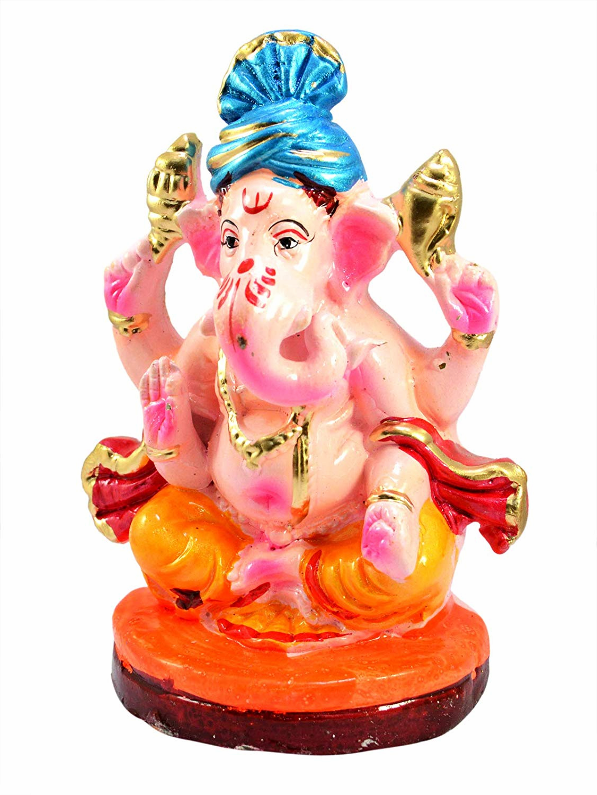

Capture the Flag competitions are a popular way of testing cyber security / forensics skills. I organized a jeopardy style CTF competition in Oculus 2020, our college fest. Such a type of event was organized for the first time in our college.   
  
I was the lead organizer and also one of the two problem setters. Since the competition was held for the first time, we didn't have an idea of the level of exposure of students of CTFs. Therefore we created some sample problems and tested them on some people in the organizing team to see whether they could crack the problem in reasonable amount of time or not. 

The event was a success and saw the participation of more than 50 teams. Many cyber security enthusiasts from other colleges too participated in the event which spanned over two days. The prize money totalled to 10K rupees. 

The detailed writeups/walkthroughs of the questions are given in the links below.

Writeups:  
<a href="https://link.medium.com/wO78TlsMd4"><i class="large medium icon"></i>Walkthrough Part 1</a>
  
<a href="https://medium.com/@shahdevansh99/spit-capture-the-flag-round-2-walkthrough-252e002d3c8"><i class="large medium icon"></i>Walkthrough Part 2</a>

<h3> Here is a sample problem</h3>
See if you can find the flag. Maybe vignaharta will help !!.

