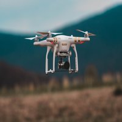
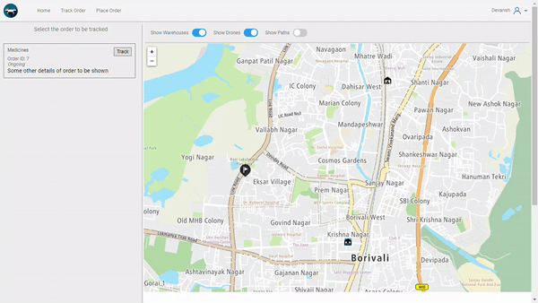
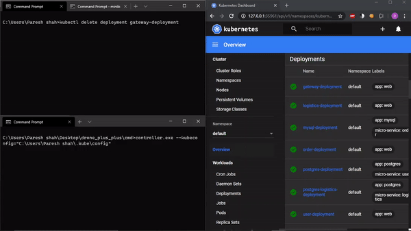

<!--  -->

 The project focuses on providing an interface through which a logistics operator can track the drones in motion.

## Features:
1. Real-time tracking of drones.
2. Placing an order to be serviced by drones.

## Architecture
The application uses a microservice architecture with three main services:
* User :- Used for registering new users,authentication purposes,login,logout and getting user details.
* Order :- Used for creating new orders.
* Logistics :- Main Purpose of this service is scheduling of drones according to the location of order and warehouse.
* Gateway :- To communicate between the frontend and the backend services. Also handles websocket communication to stream location information.

## Technology Stack
The Technology Stack used in the application is:
1. Frontend : Angular 8
2. User,Order,Logistics Service and API Gateway : Django Rest Framework
3. Deployment : Kubernetes  
4. Client-Go :- To monitor state of the Kubernetes cluster and create API objects if deleted by accident. Ensures consistent state of the application.     
5. Redis is used for showing real time tracking of drones to the frontend.

 
Source: <a href="https://github.com/dev1911/drone_plus_plus"><i class="large github icon"></i>dev1911/drone_plus_plus</a> 
 

<h2> Demo </h2>

<h3>Tracking an order</h3>

    

 
 

<h3> Maintaining state of Kubernetes API objects</h3>  
<h4>Here a deployment object is deleted using kubectl and the script instantly creates a new deployment object.</h4>

        

