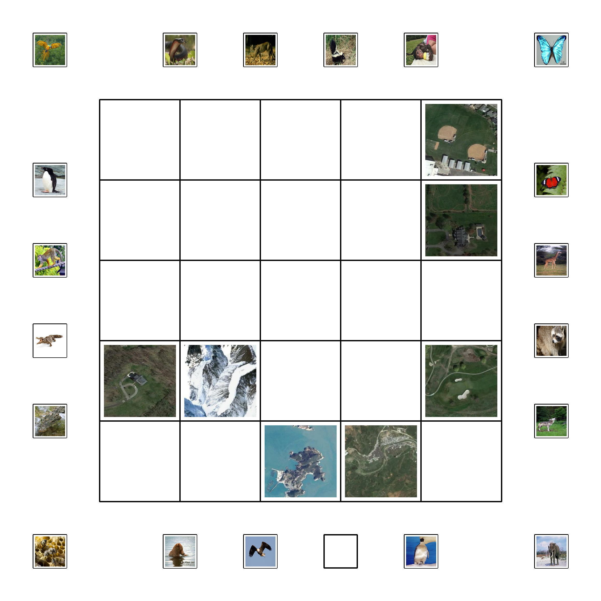
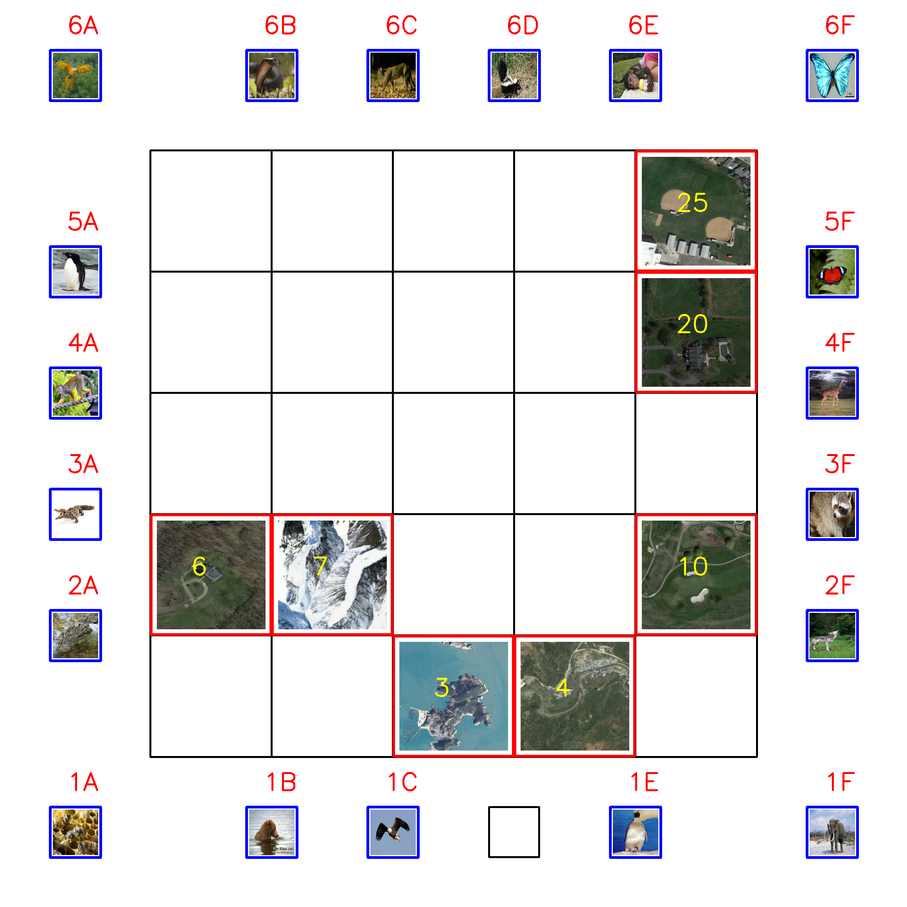
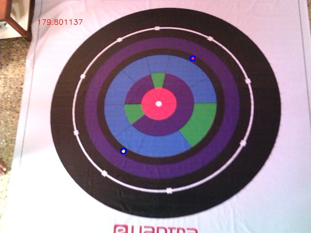

A nation wide robotics competition organised by IIT-B. I participated in two consecutive years 2018-19 and 2019-20. Being a six month long competition, I learnt a lot of new things through and cleared stage 2 of the competition. 
The competition consisted of 2 stages. The first stage had some tasks which were useful to complete stage 2. After elimination in stage 1 , each team (of 4 members) is given a theme/problem statement. The problem statement involved solving some task through a robot.  

## Eyantra 2018-19 
### Stage 1:
* Coded a neural network from scratch using PyTorch Tensors. Achieved 96% accuracy on MNIST dataset.  

### Stage 2:
* Trained two CNNs to classify images of animals (over 30 classes) and habitats (over 20 classes). Following tasks were to be completed during one run :
    * Make predictions of animals and habitats over a top view image of the arena.
    * Identify the position of each animal and habitat and create a mapping of animal-habitat.
    * Transfer this information to the robot through serial communication.
    * The white line following robot goes to each animal position, picks up a small box representing the animal, goes to the corresponding habitat and deposits the box.
* Robot used was Firebird V with an AtMEGA 2560 microcontroller.

## Eyantra 2019-20
### Stage 1:
* Some routine tasks on image processing (OpenCV).
* Processed a video to deblur individual frames using the Weiner filter and a Point Spread Function (PSF). We had to detect an Aruco marker in the deblurred video.  

### Stage 2:
* We had to detect two coin shaped markers placed on the arena using contour detection. The positions of the markers were communicated to the robot wirelessly through XBee modules. 
* In this stage we had to build the whole chassis of the robot. 
* We had to develop a striking mechanism in the robot to strike the coin shaped markers.
* The microcontroller given was Arduino UNO.

Though my team didn't qualify for the finals, I learnt a lot of new things in a very short period of time. Things like designing the chassis of robot, developing path finding algorithms, endless hours of debugging, coding everything in Embedded C, was a challenge on its own.
  

 
<h2> Examples of some tasks</h2>  
* Here, an example input image and output image of an arena are shown. Output image has positions of all detected animals and habitats overwritten on it. 

    
    

* Here, another example arena is shown. The task was to find the angle between the two markers using an overhead webcam.

 
    

 