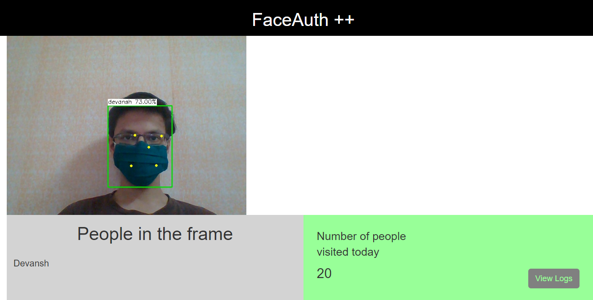

Created a face recognition pipeline connected with a logging system to mark entries of people walking past a gate. Project made as a part of SIH 2020.  

## Features  
* Add / delete faces in the "face" gallery  
* Alert raised when an unknown person gets detected. 
* A single dashboard to view all video streams and people detected in each video stream.

## Tech Stack  
* OpenVINO :- An open source edge computing framework by Intel. Used to run deep learning models. 
* Django :- Central server used to manage all video streams and insert logs. 
* ImageZMQ :- A message broker to stream video efficiently over a network. 
* MySQL :- Database to store logs.

The face recognition pipeline consisted of three parts, namely face detection , landmark identification , feature extraction. When a face is detected, the face detector model detects the ROI where the face is located. This ROI is the input to the landmark identification stage. Here, a total of 5 landmarks (2 eyes , 1 nose , 2 corners of lips) are used to straighten the image. This step greatly increases the overall accuracy of the system. The feature extractor then converts the output from the previous stage into a 256 length embedding vector. This embedding vector is then queried across the existing "face" database and the nearest match is returned as the result.  

There are a few more nuances we had to take care of:
* Use of multi threading to handle multiple video streams and achieve greater output frame rate. 
* Filtering bounding boxes of faces detected by their area to filter unwanted people who are very far away from the camera. 
  

<h2> Demo</h2>

    

 

    

