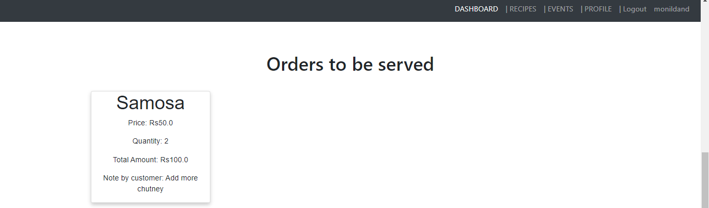

Project made as a part of [Rakathon 2.0](https://www.hackerearth.com/challenges/hackathon/rakathon-v2/) organised by Rakuten India.  

A community themed web application serving as a marketplace for home chefs. It also serves as a crowd funding / participation application for NGOs.   

 
<h2> Demo / Workflow </h2>  

<h3>
1.Customer can see recipes offered by chefs in vicinity.  
  
   
2. Once order is placed, chef can see it on the dashboard.

   
3. Chef confirms the order.  
  
 
4. Customer sees the confirmed order and proceeds to pay.  

   
5. Once payment is done, the chef can start preparing the dish.

   
6. A QR code is generated and sent to the customer. 
  
 
7. Upon delivery chef can scan the QR code using any QR code scanner to complete the order.  
 
</h3>

<h2>NGO events</h2>

<h3>
1. People can see various food donation drives.  

 
2. People can see status of the donation drive and donate accordingly.

 
3. Home chefs too can participate in donation drives.  

</h3>