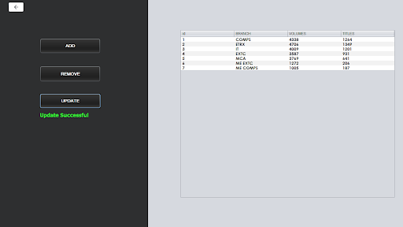
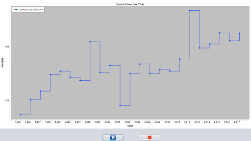
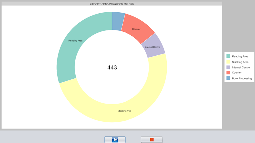

Project made as part of "Object Oriented Programming" course.  

A Java desktop application which displayed library data in graphs on a slideshow. 

## Features:
* Users can view / modify / add / delete library data. 
* Users can start a slideshow of the graphs. 

## Tech Stack:
* Java Swing :- For the GUI
* MySQL :- Database
* XCharts :- To generate graphs of data. 

Source: <a href="https://github.com/shlokashah/Data_Visualization_In_Java"><i class="large github icon"></i>Code</a>

 

    

        
        
        
    

