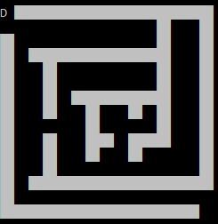

A command line maze generator/game.

Coded a program which generates random mazes of different complexities and sizes. It uses a recursive approach to divide the outermost box into 4 regions and doing it recursively to each of those 4 regions. 
 
While playing the first character of your name serves as the marker in the maze. Navigation is through "WASD" keys and the screen is refreshed everytime "Enter" is pressed. The program outputs the time taken to complete at the end of the game.

Source: <a href="https://github.com/dev1911/Maze-generator"><i class="large github icon"></i>Maze Generator</a>

 

    

        
        
        
    

